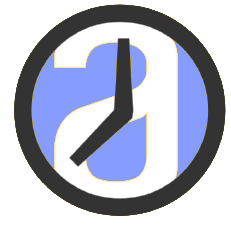
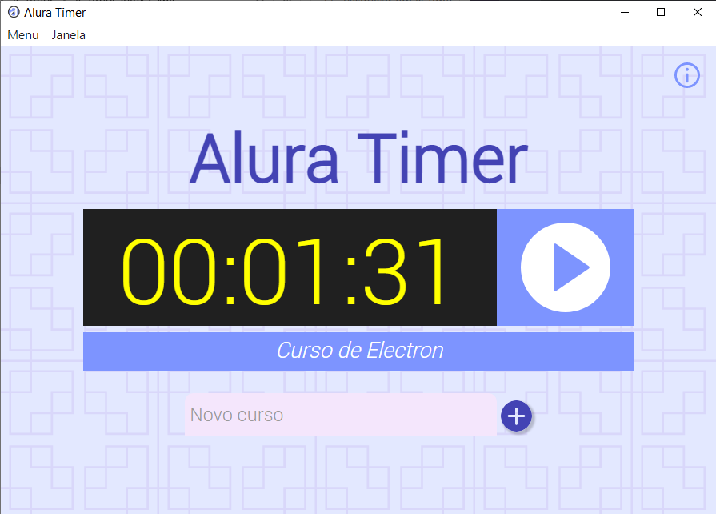

<table align="center">
  <tr>
    <td></td>
    <td><h1>JS-TIMER</h1></td>
  </tr>
</table>

<p align="center">
Aplicação desenvolvida em Javascript com Electron, durante o curso <br/>
<a href="https://cursos.alura.com.br/course/electron">Electron: crie aplicativos Desktop com as tecnologias da Web</a>, da Alura. <br />
</p>

<p align="center">
  <a href="#-tecnologias">Tecnologias</a>&nbsp;&nbsp;&nbsp;|&nbsp;&nbsp;&nbsp;
  <a href="#-projeto">Projeto</a>&nbsp;&nbsp;&nbsp;|&nbsp;&nbsp;&nbsp;
  <a href="#car-Iniciando-a-aplicação">Iniciando a aplicação</a>&nbsp;&nbsp;&nbsp;|&nbsp;&nbsp;&nbsp;
  <a href="#memo-licença">Licença</a>
</p>
<br />

<p align="center">
  
</p>
<br>

<p align="center">
  
</p>

## 🚀 Tecnologias

Esse projeto foi desenvolvido com as seguintes tecnologias:

- Javascript, HTML e CSS
- Electron

## 💻 Projeto

É uma aplicação Javascript no formato desktop (executável) que permite criar cursos e iniciar o Timer de estudos de cada curso.
O programa memoriza o tempo de estudo de cada curso e envia notificação para o Windows sempre que iniciamos o curso.
Além disso, exibe um ícone na barra de tarefas, com um menu para selecionar o curso.
<br />


## :car: Iniciando a aplicação
Baixe o repositório com git clone e entre na pasta do projeto.
```bash
$ git clone https://github.com/luiizsilverio/js-electron
$ cd js-electron
$ npm install

# Para gerar o executável no Windows.
$ npm run build
# vai criar uma subpasta com o executável e todos os arquivos necessários
```


## :memo: Licença

Esse projeto está sob a licença MIT.

---

Feito com ♥ by [Luiiz](https://github.com/luiizsilverio)
